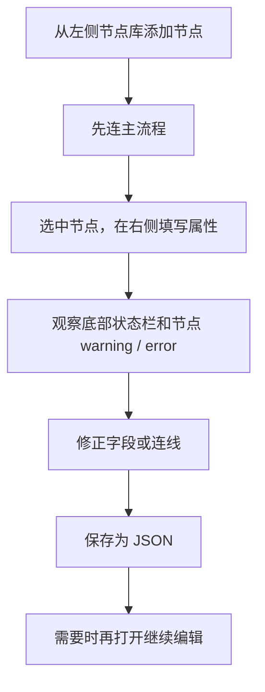

# AI Workflow Editor 使用指南

这份文档面向第一次打开应用的使用者。

如果你现在的感受是“界面看懂了，但不知道第一步该点哪里”，先看：

1. `快速上手`
2. `创建第一个工作流`
3. `常见操作`

## 这是什么

`AI Workflow Editor` 是一个桌面可视化编排编辑器，用来组织 AI 工作流结构。

你可以在画布上组合这些节点：

- `开始`
- `提示词`
- `大模型`
- `Agent`
- `记忆`
- `检索器`
- `模板变量`
- `HTTP 请求`
- `JSON 转换`
- `工具`
- `条件`
- `聊天输出`
- `输出`

当前版本重点是：

- 画布编排
- 节点配置
- 连线校验
- JSON 保存 / 加载
- 导出为 Python (LangChain) / Python 脚本
- Undo / Redo

当前版本还**不是**：

- 聊天客户端
- 模型运行器
- 通用 BPM / 低代码平台

也就是说，它现在主要解决的是“把工作流结构设计清楚并保存下来”，而不是直接执行工作流。

## 启动应用

如果你是从源码目录启动，常用命令是：

```bash
cd /Users/zhangkaiyuan/Documents/Codex/2026-04-21-github-qt-c-nodeeditor/ai-workflow-editor
./build/ai-workflow-editor
```

如果还没有构建过，可以先执行：

```bash
cmake -S /Users/zhangkaiyuan/Documents/Codex/2026-04-21-github-qt-c-nodeeditor/ai-workflow-editor -B /Users/zhangkaiyuan/Documents/Codex/2026-04-21-github-qt-c-nodeeditor/ai-workflow-editor/build
cmake --build /Users/zhangkaiyuan/Documents/Codex/2026-04-21-github-qt-c-nodeeditor/ai-workflow-editor/build --target ai-workflow-editor
```

## 界面说明

应用分成 5 个区域：

1. 顶部菜单栏和工具栏  
   用来新建、打开、保存、撤销、重做、删除、全选、居中，以及切换语言。

2. 左侧节点库  
   按类别列出可用节点。支持搜索、折叠分组、双击添加、拖拽到画布。

3. 中间工作流画布  
   用来摆放节点和连接节点。

4. 右侧 Inspector（属性面板）  
   选中节点后，在这里编辑名称、描述和该节点的类型专属配置。

5. 底部状态栏  
   显示当前选中节点的校验摘要，以及拖拽连线时的即时提示。

## 快速上手

建议第一次先按下面这条最短路径操作一遍：

1. 在左侧节点库里添加 `开始`、`提示词`、`大模型`、`输出`
2. 在画布上把它们连成一条线
3. 选中 `提示词`，填写“用户提示模板”
4. 选中 `大模型`，填写“模型名称”
5. 点击 `保存`

做完这 5 步，你就已经完成了一个最小可保存的 AI 工作流草图。

## 5 分钟体验路线

如果你只想先快速感受一下编辑器，推荐按这个顺序走一遍：

1. 双击添加 `开始`、`提示词`、`大模型`、`输出`
2. 把它们连成一条主线
3. 故意先不填 `提示词` 和 `大模型` 的字段
4. 观察节点 warning、Inspector 提示和状态栏摘要
5. 再把 `用户提示模板` 和 `模型名称` 填上
6. 按 `Command+S` 或点击 `保存`
7. 关闭后重新打开刚才的 JSON

这一轮体验可以一次看懂：

- 节点库怎么加节点
- 画布怎么连线
- Inspector 怎么填
- 校验提示在哪看
- 保存 / 打开 / 未保存变更的基本行为

## 创建第一个工作流

推荐从这条链路开始：

```text
开始 -> 提示词 -> 大模型(success) -> 输出
```

### 第 1 步：添加节点

你可以用两种方式加节点：

- 在左侧节点库里双击节点
- 从左侧节点库拖到中间画布

建议第一次直接双击添加，比较快。

### 第 2 步：连接节点

在画布里，从一个节点右侧或输出侧的端口拖到另一个节点左侧或输入侧的端口。

当前要注意：

- 只能从输出端口连到输入端口
- `开始` 没有输入端口
- `输出` 没有输出端口
- `条件` 有两个输出端口：`True` 和 `False`
- `大模型` 有两个输出端口：`Success` 和 `Error`
- 端口有数据类型约束，不兼容的端口之间无法连线：
  - `flow`（通用流）：`开始`、`记忆`、`检索器`、`模板变量`、`工具`、`条件` 等使用
  - `text`（文本）：`提示词` 输出 → `大模型` / `Agent` 输入
  - `completion`（完成结果）：`大模型` / `Agent` 的 Success 输出
  - `error`（错误）：`大模型` / `Agent` / `HTTP 请求` 的 Error 输出
  - `http_response`（HTTP 响应）：`HTTP 请求` 的 Success 输出
  - 通用流（`flow`）输入端口可以接受任何类型的输出

如果连线不合法，状态栏会直接提示，节点也会显示 warning / error 状态。

### 第 3 步：配置节点

选中节点后，到右侧 Inspector 编辑属性。

所有节点都有：

- `名称`
- `描述`

部分节点还有专属配置：

- `提示词`
  - `系统提示词`
  - `用户提示模板`
- `大模型`
  - `模型名称`
  - `温度`
  - `最大令牌数`
- `Agent`
  - `Agent 指令`
  - `模型名称`
  - `最大迭代次数`
- `聊天输出`
  - `消息角色`
  - `消息模板`
- `记忆`
  - `记忆键`
- `检索器`
  - `检索器键`
- `模板变量`
  - `变量 JSON`
- `HTTP 请求`
  - `请求方法`
  - `请求 URL`
  - `请求头 JSON`
  - `请求体模板`
  - `超时（毫秒）`
- `JSON 转换`
  - `转换 JSON`
- `工具`
  - `工具名称`
  - `超时（毫秒）`
  - `输入映射`

### 第 4 步：处理校验提示

当前版本有 3 个地方会提示问题：

- Inspector 顶部提示
- 节点卡片的 warning / error 外观
- 底部状态栏摘要

几个常见提示：

- `提示词模板为空`
- `模型名称不能为空`
- `Agent 指令不能为空`
- `Agent 模型名称不能为空`
- `聊天输出模板不能为空`
- `记忆键不能为空`
- `请求 URL 不能为空`
- `请求头必须是合法的 JSON 对象`
- `转换 JSON 不能为空`
- `转换 JSON 必须是合法的 JSON 对象`
- `工具名称不能为空`
- `输入映射必须是合法的 JSON 对象`
- `开始节点需要连接到下一步`
- `输出节点需要输入连接`
- `条件节点需要同时连接 True 和 False 分支`

建议做法是：

1. 先看底部状态栏，知道当前问题是什么
2. 再看右侧 Inspector，直接改对应字段
3. 修改后确认 warning / error 是否消失

### 第 5 步：保存工作流

保存后会生成一个 JSON 文件。

常见入口：

- 工具栏 `保存`
- 菜单 `文件 -> 保存`
- 菜单 `文件 -> 另存为`

重新打开时用：

- 工具栏 `打开`
- 菜单 `文件 -> 打开`
- 菜单 `文件 -> 最近文件`

如果当前文档有未保存更改：

- 窗口标题会带 `*`
- 新建 / 打开 / 关闭前会弹确认
- 你可以选择先保存，再继续操作

### 第 6 步：导出为 Python 代码

工作流可以导出为可执行的 Python 代码。

菜单入口：`文件 -> 导出`

支持两种格式：

- **Python (LangChain)** — 生成使用 LangChain 框架的代码，包含 `ChatPromptTemplate`、`ChatOpenAI`、`AgentExecutor` 等组件，并自动组装 chain
- **Python 脚本** — 生成纯 Python 函数式代码，每个节点对应一个函数，最后有 `run_workflow()` 串联整个流程

导出的代码包含 `TODO` 注释标记需要补充的实现细节（如工具逻辑、条件判断等）。

## 当前支持的节点

### 开始

- 作用：工作流入口
- 典型用法：作为第一步
- 校验要求：必须连接到下一步

### 提示词

- 作用：组织系统提示词和用户提示模板
- 典型用法：放在大模型前面
- 校验要求：`用户提示模板` 不能为空

### 大模型

- 作用：表示一次模型调用
- 典型用法：接在提示词后面
- 校验要求：`模型名称` 不能为空

### 记忆

- 作用：表示一个工作流记忆槽
- 典型用法：在工作流中插入记忆读写步骤
- 校验要求：`记忆键` 不能为空

### 检索器

- 作用：表示一个检索步骤
- 典型用法：在提示词前后插入知识检索
- 校验要求：`检索器键` 不能为空

### 模板变量

- 作用：定义模板变量映射
- 典型用法：在提示词前准备变量输入
- 校验要求：
  - 不能为空
  - 必须是合法 JSON 对象

### HTTP 请求

- 作用：描述一次外部 HTTP 调用
- 典型用法：在工作流里表达某一步要请求外部接口
- 校验要求：
  - `请求 URL` 不能为空
  - `请求头 JSON` 如果填写，必须是合法 JSON 对象

### JSON 转换

- 作用：把上一步的 JSON 结果重组为一个新的 JSON 对象
- 典型用法：放在 `HTTP 请求`、`工具` 或其他产生结构化结果的节点后面
- 校验要求：
  - `转换 JSON` 不能为空
  - 必须是合法 JSON 对象

### 工具

- 作用：表示一次工具调用
- 典型用法：在模型前后接外部工具能力
- 校验要求：
  - `工具名称` 不能为空
  - `输入映射` 如果填写，必须是合法 JSON 对象

### 条件

- 作用：分支控制
- 典型用法：把流程拆成 `True` / `False` 两路
- 校验要求：
  - 必须有输入连接
  - `True` 和 `False` 两个分支都要接出

### 输出

- 作用：表示工作流结果
- 典型用法：作为收尾节点
- 校验要求：必须有输入连接

## 常见操作

### 选择

- 点击节点：选中节点
- 点击连线：选中连线
- `全选`：选择当前画布内容

### 复制 / 粘贴 / 复制副本

- `Command+C`：复制选中节点
- `Command+V`：粘贴到鼠标光标位置
- `Command+D`：复制副本（原位偏移 +40px）
- 也可以通过 `编辑` 菜单或右键菜单操作

粘贴时节点组会以鼠标当前位置为中心放置。复制副本是"复制 + 立即粘贴"的快捷操作。

### 删除

- 选中节点或连线后按 `Delete`
- 或点击工具栏 `删除`

当前删除支持：

- 删除节点
- 删除连线
- 混合选择后一起删除
- Undo / Redo 恢复

### 撤销 / 重做

当前已经纳入 Undo / Redo 的操作包括：

- 创建节点
- 编辑 Inspector 属性
- 删除节点
- 创建连线
- 删除连线

### 居中

点击工具栏 `居中` 可以把当前工作区内容重新带回视野中央，适合画布拖远之后快速回到主区域。

### 搜索节点

左侧节点库顶部有搜索框。

输入关键字后：

- 只保留匹配的节点
- 不匹配的分组会自动隐藏

### 切换语言

右上角语言按钮可以在：

- `中文`
- `English`

之间切换。

默认语言是中文，而且会记住你的上次选择。

## 快捷键速查

当前已经接入的常用快捷键：

- `New`：系统标准新建快捷键
- `Open`：系统标准打开快捷键
- `Save`：系统标准保存快捷键
- `Save As`：系统标准另存为快捷键
- `Undo`：系统标准撤销快捷键
- `Redo`：系统标准重做快捷键
- `Select All`：系统标准全选快捷键
- `Copy`：系统标准复制快捷键
- `Paste`：系统标准粘贴快捷键
- `Duplicate`：`Command+D`
- `Delete`：`Delete`
- `Center`：`Space`

在 macOS 上，通常分别对应：

- `Command+N`
- `Command+O`
- `Command+S`
- `Shift+Command+S`
- `Command+Z`
- `Shift+Command+Z`
- `Command+A`

如果某个动作当前不可用，工具栏按钮会自动变灰。

## 校验速查

可以把下面这张表当成“为什么节点发黄或发红”的快速对照。

| 节点 | 典型问题 | 处理方式 |
| --- | --- | --- |
| 开始 | 没有连到下一步 | 从 `开始` 的输出端口连出去 |
| 提示词 | `用户提示模板` 为空 | 在 Inspector 填写模板 |
| 大模型 | `模型名称` 为空 | 在 Inspector 填写模型名称 |
| 记忆 | `记忆键` 为空 | 在 Inspector 填写记忆键 |
| 检索器 | `检索器键` 为空 | 在 Inspector 填写检索器键 |
| 模板变量 | 变量内容为空 | 在 Inspector 填写变量 JSON |
| 模板变量 | 不是合法 JSON 对象 | 改成合法 JSON 对象 |
| JSON 转换 | 转换内容为空 | 在 Inspector 填写转换 JSON |
| JSON 转换 | 不是合法 JSON 对象 | 改成合法 JSON 对象 |
| 工具 | `工具名称` 为空 | 在 Inspector 填写工具名称 |
| 工具 | `输入映射` 不是合法 JSON | 改成合法 JSON 对象 |
| 条件 | 没有输入连接 | 给条件节点接入上游 |
| 条件 | 只连了一边分支 | 同时接出 `True` 和 `False` |
| 输出 | 没有输入连接 | 给输出节点接入上游 |

提示颜色大致可以这样理解：

- `warning`：结构或必填项不完整，但还能继续编辑
- `error`：字段内容本身不合法，应该先修正

## 推荐操作流程

如果你要认真搭一个工作流，推荐按这个顺序：



## 一个最小示例

可以先做下面这个示例：

- `开始`
- `提示词`
- `大模型`
- `输出`

建议填写：

- `提示词 -> 用户提示模板`
  - `请总结以下内容：{{input}}`
- `大模型 -> 模型名称`
  - `demo-model`

连线建议：

- `开始.out -> 提示词.in`
- `提示词.out -> 大模型.in`
- `大模型.success -> 输出.in`

这个例子适合用来熟悉：

- 节点添加
- Inspector 编辑
- 连线规则
- 校验提示
- 保存 / 打开

## 再试一个包含记忆的示例

如果你想体验 `记忆` 节点，可以试这条更长一点的链路：

```text
开始 -> 提示词 -> 大模型(success) -> 记忆 -> 输出
```

建议填写：

- `提示词 -> 用户提示模板`
  - `请总结本轮对话内容：{{input}}`
- `大模型 -> 模型名称`
  - `demo-model`
- `记忆 -> 记忆键`
  - `conversation_summary`

这个例子适合用来确认：

- 新节点类型已经可以加入画布
- `记忆键` 会参与校验
- 保存后重新打开还能保留 `记忆键`

## 再试一个包含检索器的示例

如果你想体验 `检索器` 节点，可以试这条链路：

```text
开始 -> 检索器 -> 提示词 -> 大模型(success) -> 输出
```

建议填写：

- `检索器 -> 检索器键`
  - `knowledge_base_search`
- `提示词 -> 用户提示模板`
  - `基于检索结果回答：{{input}}`
- `大模型 -> 模型名称`
  - `demo-model`

这个例子适合用来确认：

- `retriever` 已经可以加入节点库和画布
- `检索器键` 会参与字段级校验
- 保存后重新打开还能保留 `检索器键`

## 再试一个包含模板变量的示例

如果你想体验 `模板变量` 节点，可以试这条链路：

```text
开始 -> 模板变量 -> 提示词 -> 大模型(success) -> 输出
```

建议填写：

- `模板变量 -> 变量 JSON`
  - `{"topic": "{{input}}", "style": "concise"}`
- `提示词 -> 用户提示模板`
  - `请用 {{style}} 风格总结 {{topic}}`
- `大模型 -> 模型名称`
  - `demo-model`

这个例子适合用来确认：

- 模板变量节点可以保存一组 JSON 映射
- 空值和非法 JSON 都会被校验出来
- 保存后重新打开还能保留变量映射

## 再试一个包含 HTTP 请求的示例

如果你想体验 `HTTP 请求` 节点，可以试这条链路：

```text
开始 -> HTTP 请求(success) -> 输出
```

建议填写：

- `HTTP 请求 -> 请求方法`
  - `POST`
- `HTTP 请求 -> 请求 URL`
  - `https://api.example.com/search`
- `HTTP 请求 -> 请求头 JSON`
  - `{"Authorization": "Bearer {{token}}"}`
- `HTTP 请求 -> 请求体模板`
  - `{"query": "{{input}}"}`
- `HTTP 请求 -> 超时（毫秒）`
  - `30000`

这个例子适合用来确认：

- `HTTP 请求` 已经可以加入节点库和画布
- 空 URL 会给出 warning
- 非法请求头 JSON 会给出 error
- 保存后重新打开还能保留请求配置

## 再试一个包含 JSON 转换的示例

如果你想体验 `JSON 转换` 节点，可以试这条链路：

```text
开始 -> HTTP 请求(success) -> JSON 转换 -> 输出
```

建议填写：

- `HTTP 请求 -> 请求 URL`
  - `https://api.example.com/search`
- `JSON 转换 -> 转换 JSON`
  - `{"summary": "{{http.response.summary}}", "source": "search-api"}`

这个例子适合用来确认：

- `JSON 转换` 已经可以加入节点库和画布
- 空值和非法 JSON 都会被校验出来
- 保存后重新打开还能保留转换配置

## 常见问题

### 为什么我点了节点，右边什么都没有？

先确认是不是已经真正选中了节点。

正常情况下：

- 节点被选中后，右侧会出现该节点的名称、描述和类型配置
- 如果没有选中任何节点，Inspector 会显示提示文案

### 为什么我连不上两个节点？

优先检查这几件事：

- 你是不是从输出端口拖向输入端口
- 目标节点的端口方向对不对
- 当前节点类型之间的连接是否符合规则

如果不合法，底部状态栏会即时提示。

### 为什么节点旁边有 warning 或 error？

说明这个节点当前还不完整，或者字段内容不合法。

最常见的是：

- 必填字段没填
- `HTTP 请求` 的 `请求头 JSON` 不是合法 JSON
- `工具` 的 `输入映射` 不是合法 JSON
- `开始 / 条件 / 输出` 的结构连线不完整

### 为什么有时候工具栏按钮是灰的？

按钮现在会跟随当前场景状态启用或禁用。

例如：

- 没有任何节点时，`全选` 和 `居中` 会变灰
- 没有可撤销历史时，`撤销` 会变灰
- 没有选中内容时，`删除` 会变灰

### 如果改错了，怎么回退？

先试：

- `Command+Z` 撤销
- `Shift+Command+Z` 重做

当前已经支持撤销 / 重做的包括：

- 创建节点
- 编辑 Inspector 属性
- 创建连线
- 删除连线
- 删除节点

### 保存之后再撤销，会发生什么？

当前版本已经把 dirty state 和 undo stack 的 clean state 对齐了。

你可以理解成：

- 保存那一刻会被记成一个“干净点”
- 如果之后又有修改，窗口会重新变成未保存状态
- 撤销回到保存点时，会重新恢复成干净状态

### JSON 文件是做什么的？

它是当前工作流的结构化保存结果，主要包含：

- 节点类型
- 节点名称和描述
- 节点属性
- 节点位置
- 连线关系

当前版本主要用它来：

- 保存工作流草图
- 重新打开继续编辑
- 在团队内共享结构定义

## 目前要知道的限制

当前版本请先按“编辑器”来理解，而不是“执行器”：

- 还没有真正的工作流执行引擎
- 还没有运行结果面板
- 还没有 canvas 内搜索
- 目前还没有运行时执行引擎，编辑器侧完成的是节点编排、属性配置、校验反馈与保存加载

但它已经适合用来：

- 设计工作流结构
- 和团队讨论流程
- 保存工作流草图
- 做节点属性配置和连接校验

## 后续文档约定

从现在开始，任何用户可见的新功能都应该同步更新：

- 这份 `docs/user-guide.md`
- `docs/README.md` 里的入口说明

如果功能改变了用户操作方式，文档更新应当和功能代码一起提交。
